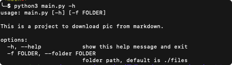
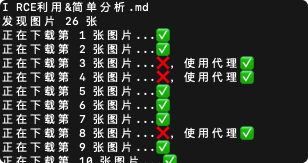

# Markdown_batch_tools
Markdown files batch processing for download imgs or fill filename to de first line.

批量递归下载markdown文件中的图片，并且保存到本地md文件名.assets路径下，修改替换原文中的图片地址为本地相对路径，调整所有md文档内容首行设置为文件名。


# 背景：
最近在整理资料库发现有很多文件中使用的是在线图片或者图床文件，有的已经因为图床过期或者图床不可用导致目前无法查看图片了，因此需要定期及时的针对在线图片进行本地化留存，中间找了挺多git里开源工具不是针对图片异常处理不够就是功能不完整有很多bug，因此有了这个工具。

# 功能：
1. 批量递归下载md中的图片
2. 保存本地md文件名.assets文件夹中
3. md文件中图片路径替换
4. 对所有md文件中第一行不是文件名的全都补上文件名，方便导入的时候没有文件名展示（mweb的导入问题，没办法了只能专门优化下，懂得都懂老哥开发了之后不是经常优化也是比较蛋疼）


# Install:
```
git clone https://github.com/x7peeps/Markdown_batch_tools.git
python3 main.py
```


# Usage：

-h help
-f 文件夹路径 


```
main.py -f <folder>
```
执行效果


